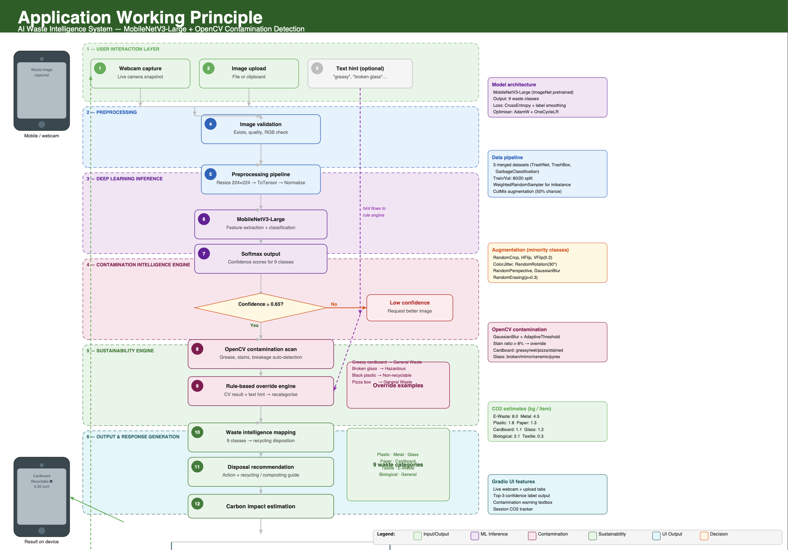
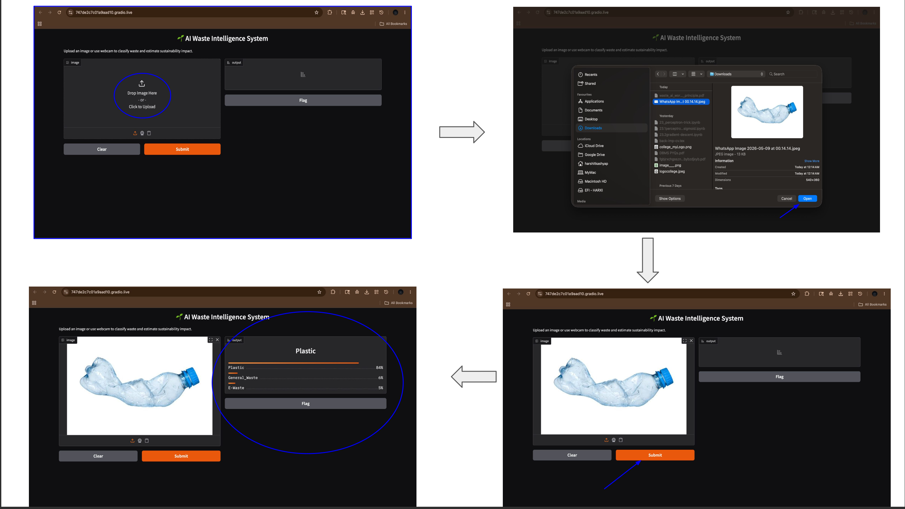
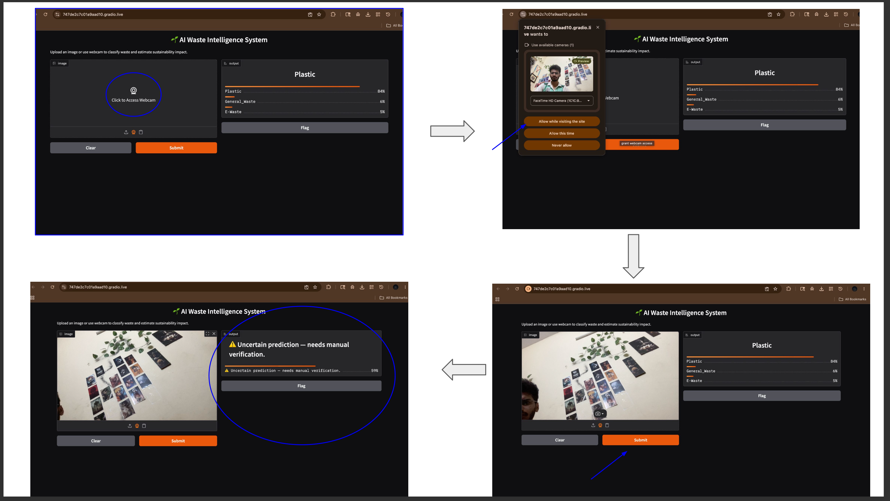
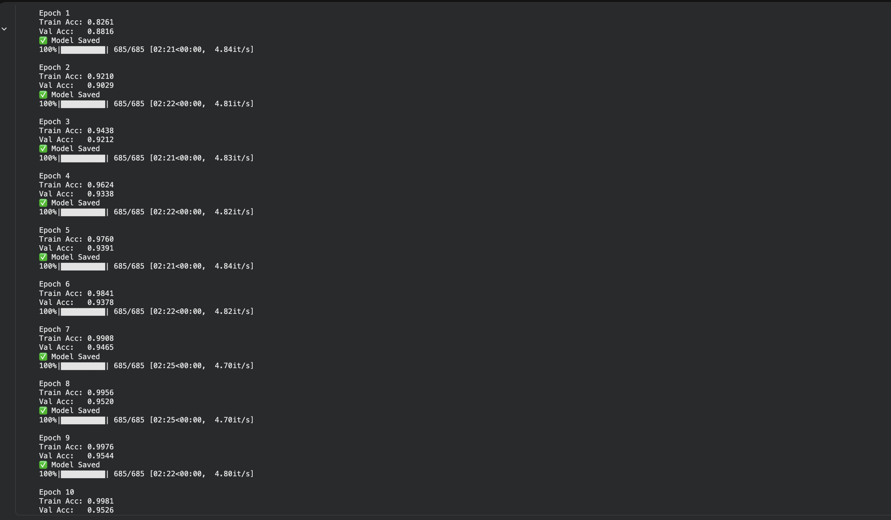
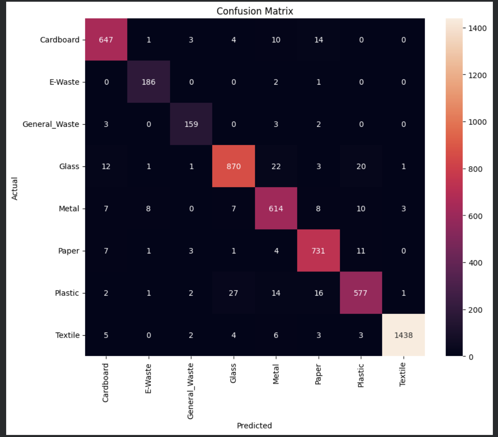

♻️ AI Waste Intelligence System

📌 Project Overview

The AI Waste Intelligence System is an AI-powered waste classification platform developed using Deep Learning, Computer Vision, and Transfer Learning techniques.

The system automatically classifies different categories of waste materials using images captured from:

* Uploaded waste images
* Real-time webcam input
* Smart waste monitoring interfaces

The project aims to improve:

* Waste segregation
* Recycling efficiency
* Smart city waste management
* Sustainable environmental practices

The system uses the MobileNetV3-Large Deep Learning architecture trained on a unified multi-class waste dataset.

⸻

🌍 Problem Statement

Traditional waste segregation methods rely heavily on manual sorting processes which are:

* Time-consuming
* Expensive
* Error-prone
* Inefficient for large-scale waste management

Improper waste classification leads to:

* Environmental pollution
* Landfill overflow
* Reduced recycling efficiency
* Increased operational cost

This project solves the problem using:

✅ Artificial Intelligence

✅ Deep Learning

✅ Real-Time Computer Vision

✅ Automated Waste Classification

⸻

🚀 Key Features

✅ Multi-Class Waste Classification

The system classifies waste into:

Waste Category	Description
Plastic	Bottles, containers, plastic waste
Paper	Newspapers, office paper
Cardboard	Cartons and cardboard materials
Glass	Glass bottles and fragments
Metal	Metal cans and metallic waste
Textile	Clothes and fabric waste
E-Waste	Electronic components
General Waste	Mixed/non-recyclable waste

⸻

✅ Real-Time Webcam Detection

The system supports:

* Live webcam input
* Real-time waste prediction
* Confidence score generation
* Interactive waste detection

⸻

✅ Interactive Web Interface

A modern web application was developed using Gradio.

Features include:

* Drag & Drop image upload
* Webcam access
* AI prediction results
* Confidence visualization
* User-friendly interface

⸻

✅ Deep Learning Powered

The system uses:

* MobileNetV3-Large
* Transfer Learning
* PyTorch Framework
* CNN-based image classification

⸻

📂 Dataset Information

The final unified dataset was created by merging multiple public waste datasets.

📊 Dataset Statistics

Class	Total Images
Plastic	3196
Paper	3788
Cardboard	3391
Glass	4647
Metal	3285
Textile	7302
E-Waste	945
General Waste	834

✅ Total Images : 27,388

⸻

📁 Dataset Access (Google Drive)

🔗 Dataset Download Link

Paste your Google Drive dataset link below:

https://drive.google.com/file/d/1QL8YBDZNnmmiJ1_WVpih1tC236lfTrmh/view?usp=sharing

⸻

⚠️ IMPORTANT DATASET INSTRUCTIONS

The dataset is very large and cannot be uploaded directly to GitHub.

Therefore, the dataset is provided separately using Google Drive.

📌 Follow These Steps Carefully

Step 1 : Download Dataset ZIP

Download:

Data.zip

from the Google Drive link.

⸻

Step 2 : Upload Dataset to Your Google Drive

After downloading:

1. Open your Google Drive
2. Upload the Data.zip file
3. Wait for upload completion

⸻

Step 3 : Open Google Colab

Open:

Google Colab

and upload the notebook.

⸻

Step 4 : Mount Google Drive

Run the following code:

from google.colab import drive
drive.mount('/content/drive')

⸻

Step 5 : Extract Dataset ZIP

Update the dataset path according to your Google Drive location.

import zipfile
zip_path = '/content/drive/MyDrive/Data.zip'
extract_path = '/content/dataset'
with zipfile.ZipFile(zip_path, 'r') as zip_ref:
    zip_ref.extractall(extract_path)
print("Dataset Extracted Successfully")

⸻

Step 6 : Run All Notebook Cells

Now run all notebook cells sequentially.

The notebook will:

* Load dataset
* Preprocess images
* Train MobileNetV3
* Generate predictions
* Launch Gradio interface

⸻

🛠️ Technologies Used

Technology	Purpose
Python	Programming Language
PyTorch	Deep Learning Framework
Torchvision	Data Augmentation
OpenCV	Computer Vision
NumPy	Numerical Operations
Pandas	Data Handling
Matplotlib	Visualization
Scikit-learn	Evaluation Metrics
Gradio	Web Interface

⸻

🏗️ System Architecture

⸻

🔄 Project Workflow

Waste Image Input
        ↓
Image Preprocessing
        ↓
Data Augmentation
        ↓
MobileNetV3 Feature Extraction
        ↓
Deep Learning Classification
        ↓
Prediction Output
        ↓
Gradio Web Interface

⸻

📸 System Demonstration

🖼️ Image Upload Prediction

⸻

🎥 Webcam-Based Prediction

⸻

📈 Training Results

📊 Training and Validation Accuracy

⸻

🔍 Confusion Matrix

⸻

🧪 Model Training Details

Model Used

* MobileNetV3-Large

Training Techniques

* Transfer Learning
* Data Augmentation
* Adam Optimizer
* Cross Entropy Loss
* Learning Rate Scheduling
* Early Stopping

⸻

⚙️ Installation Guide

Step 1 : Clone Repository

git clone https://github.com/YOUR_USERNAME/AI-Waste-Intelligence-System.git

⸻

Step 2 : Move into Project Directory

cd AI-Waste-Intelligence-System

⸻

Step 3 : Install Required Libraries

pip install -r requirements.txt

⸻

▶️ Run the Project

Run Notebook

Open Jupyter Notebook or Google Colab and execute:

ai_based_waste_detection.ipynb

⸻

📦 requirements.txt

torch
torchvision
opencv-python
numpy
pandas
matplotlib
scikit-learn
gradio
Pillow

⸻

💡 Applications

The proposed system can be used in:

* Smart Waste Management Systems
* Recycling Industries
* Smart Cities
* IoT Smart Dustbins
* Educational Research
* Environmental Monitoring
* Industrial Waste Segregation

⸻

✅ Advantages

* Automated waste classification
* High prediction accuracy
* Real-time webcam prediction
* Lightweight Deep Learning model
* User-friendly web interface
* Supports sustainable recycling

⸻

⚠️ Limitations

* Requires large labeled datasets
* Performance depends on image quality
* Complex waste mixtures may reduce accuracy
* Real-time prediction depends on hardware capability

⸻

🔮 Future Scope

Future improvements may include:

* IoT Smart Bin Integration
* Cloud Deployment
* Mobile Application Development
* Advanced Transformer-Based AI Models
* Large-Scale Smart City Deployment
* Edge AI Deployment

⸻

👨‍💻 Author

Harshit Kashyap

B.Tech Computer Science Engineering

Rashtrakavi Ramdhari Singh Dinkar College of Engineering

⸻

📜 License

This project is developed for:

* Academic Research
* Educational Purposes
* AI and Deep Learning Learning
* Smart Waste Management Research

⸻

⭐ Support the Project

If you found this project useful:

⭐ Star the repository

🍴 Fork the repository

📢 Share with others

⸻

🙌 Thank You

♻️ Together We Can Build a Smarter and Cleaner Future ♻️

